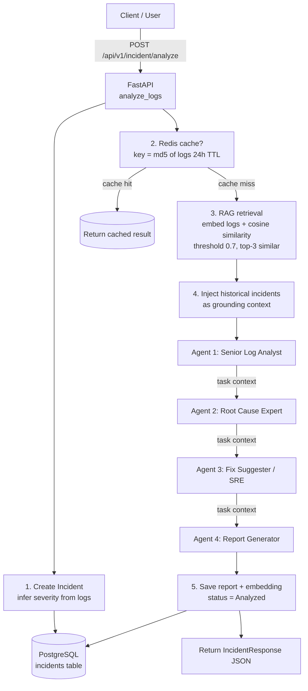
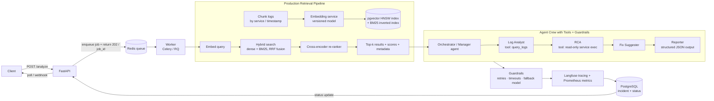

# OpsPilot.ai — Interview Presentation Doc (Flows)

Two flows you can present to an interviewer:

- **Flow 1 — Current system (as built)**: a multi-agent incident-response pipeline (CrewAI) with in-app RAG.
- **Flow 2 — Production-grade target (design)**: a scalable agentic + retrieval architecture (async worker, hybrid search, re-ranking, tracing).

Each flow has ① a Mermaid diagram (renders on GitHub / VS Code / Typora), ② an ASCII diagram (renders anywhere, printable), ③ a numbered walk-through, and ④ the talking points to say out loud.

---

# FLOW 1 — Current System (Agentic Incident Response, as built)

## 1.1 Mermaid diagram


## 1.2 ASCII diagram (printable)

```text
Client ──POST /api/v1/incident/analyze──▶ FastAPI
                                          │
                    ┌─────────────────────┴───────────────────┐
                    ▼ 1. Create Incident                      ▼ 2. Redis cache (md5 of logs)
            PostgreSQL (incidents)                   ┌─ cache HIT ─▶ return cached result ─┐
                    ▲                               │                                      │
                    │                               └─ cache MISS ─────────────────────────┘
                    │                                 ▼
                                3. RAG: embed logs ─▶ cosine vs incident embeddings ─▶ top-3 (≥ 0.7)
                                                    │ (historical incidents as context)
                                4. CrewAI sequential ▼
                    Agent1 Log Analyst ─▶ Agent2 RCA ─▶ Agent3 Fix Suggester ─▶ Agent4 Report Gen
                                                    │
                    5. Save report + embedding ◀────┘
                                                    ▼
                                 Return IncidentResponse JSON
```

## 1.3 Numbered walk-through (say this)

1. **Entry**: `POST /api/v1/incident/analyze` with raw logs; FastAPI validates via Pydantic (`AnalysisRequest`); an `Incident` row is created and `severity` is inferred from log keywords.
2. **Cache**: the hash of the logs is looked up in Redis; identical requests skip the expensive pipeline for 24h.
3. **RAG**: the logs are embedded and compared (cosine, threshold 0.7) against all stored incident embeddings; top-3 similar incidents become grounding context.
4. **Orchestration**: CrewAI runs 4 agents sequentially — Log Analyst → RCA → Fix Suggester → Report Generator — passing output forward via `Task(context=...)`.
5. **Persist**: the generated report is saved, the new incident is embedded (so future searches find it), and the JSON response is returned.
---

# FLOW 2 — Production-Grade Target (Agentic + Retrieval at Scale)

## 2.1 Mermaid diagram


- **Honest limits (volunteer these):** crew is **synchronous/blocking**; retrieval is an **O(n) Python scan** (JSON embeddings, not pgvector); report is **free-form markdown**, so `root_cause`/`suggested_fix`/`confidence` aren't structured model outputs.
## 2.2 ASCII diagram (printable)

```text
Client ──POST /analyze──▶ FastAPI ──enqueue + 202 / job_id──▶ Redis Queue
                                                              │
                                                              ▼
                                                      Worker (Celery / RQ)
                                                              │
        ┌─────────────────────────────────────────────────────┴───────────────┐
        │ Production Retrieval Pipeline                                      │
        │    Chunk logs → Embed (versioned) → Index (pgvector HNSW + BM25)   │
        │    Query embed → Hybrid dense+BM25 (RRF) → Re-rank → Top-k         │
        └──────────────────────────────────────────────┬──────────────────────┘
                                                       ▼
        Orchestrator Agent ─▶ Log Analyst(tool) ─▶ RCA(tool) ─▶ Fix ─▶ Reporter(JSON)
                                                       │
                              Guardrails: retries / timeouts / fallback model
                                                       │
                        Langfuse tracing + Prometheus metrics
                                                       │
                                                       ▼
                                          PostgreSQL (status) ──▶ client polls / webhook
```

## 2.3 Numbered walk-through (say this)

1. **Async entry**: the API enqueues a job and immediately returns `202 + job_id`; the client polls or gets a webhook — no blocking request thread.
2. **Retrieval pipeline**: logs are chunked, embedded with a **versioned** embedding model, and indexed (pgvector HNSW + BM25). The query is **hybrid**-searched (dense + keyword, combined by RRF) then **re-ranked** with a cross-encoder → top-k with scores and metadata.
3. **Agent orchestration**: a manager plans; sub-agents run with **tools** (read-only query/exec), producing **structured JSON** output.
4. **Guardrails + observability**: retries, timeouts, fallback models; **Langfuse** traces every agent turn; **Prometheus** tracks latency/cost/error rate.
5. **Feedback loop**: resolved incidents are re-embedded → retrieval quality improves over time.

## 2.4 Talking points

- "202 + job_id pattern fixes the synchronous bottleneck of the MVP."
- "Hybrid search catches exact error codes (BM25) that pure semantics miss; re-ranking fixes top-k ordering."
- "Structured output means downstream fields (`root_cause`, `suggested_fix`, `confidence`) are model-produced, not heuristics."
- "Langfuse is already scaffolded in config; wiring the Crew's tracing callbacks is a roadmap item."

---

# Side-by-side: MVP vs Production-grade

| Concern | Flow 1 (current) | Flow 2 (production) |
|---|---|---|
| Request handling | Synchronous, blocking | Async job queue (202 + poll/webhook) |
| Vector store | JSON column + in-Python cosine (O(n)) | pgvector `VECTOR` + HNSW / BM25 hybrid |
| Re-ranking | None | Cross-encoder re-ranker |
| Agent tools | None | Allow-listed read-only tools |
| Output | Free-form markdown | Structured JSON |
| Observability | Prometheus + JSON logs | + Langfuse per-agent tracing |
| Failure handling | Whole crew fails | Retries / timeouts / fallback model |
| Retrieval eval | Manual / none | RAGAS + recall@k in CI |

---

# 60-second narration scripts

**Flow 1 (what it does):** *"The client posts logs; FastAPI creates an incident and checks Redis. On a miss we embed the logs, pull the top-3 similar historical incidents with a 0.7 cosine threshold, and feed that as grounding into a CrewAI pipeline of four sequential agents — log analyst, RCA, fix suggester, report generator. The final report is stored and re-embedded, so the retrieval index improves with every incident."*

**Flow 2 (what production looks like):** *"I'd move the crew to a background worker — return 202 with a job id and run Celery or RQ off Redis. Retrieval becomes production-grade: chunked ingestion, versioned embeddings, pgvector with an HNSW index, hybrid dense-plus-BM25 search with reciprocal-rank fusion, and a cross-encoder re-ranker. Agents get allow-listed tools and structured JSON output; every turn is traced in Langfuse and metered in Prometheus; retries and fallback models protect against LLM failures; and each resolved incident feeds back into the index."*

---

<!-- Rehearse: define each keyword once with a project example (Agent, Task, Crew, context, RAG, hybrid search, HNSW, RRF, LLM-as-judge, observability). -->