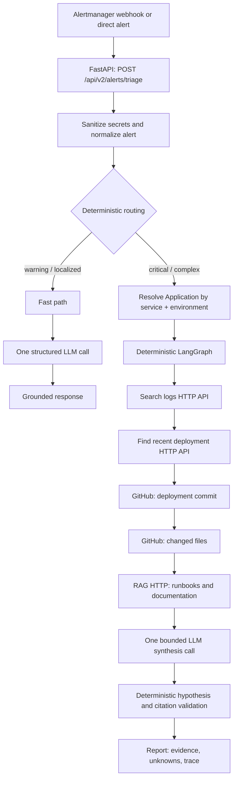

# OpsPilot.ai

OpsPilot.ai is an Applied AI incident-investigation service. It accepts alerts, resolves the
affected application and its integrations, collects verifiable evidence, and returns a traced,
evidence-backed investigation report.

The active design is deliberately hybrid:

- **Deterministic code** controls routing, application resolution, tool execution, evidence
  collection, citation validation, and stopping conditions.
- **One bounded LLM call** synthesizes caveated hypotheses and next steps from the evidence already
  collected. It cannot call tools, alter the graph, or create valid citations outside that bundle.

This keeps the system inspectable and testable while reserving LLM reasoning for the task where it
adds value: interpreting evidence rather than acquiring or controlling it.

## Active architecture



### Investigation sequence

For an investigation route, the graph follows this controlled sequence:

1. Resolve `service_name` and `environment` to an `Application` configuration.
2. Query logs using the requested time window, environment, service, and pool-timeout terms.
3. Query deployments in the same time window.
4. If a deployment identifies a commit, inspect that commit through GitHub.
5. If a valid baseline and deployment commit are available, inspect changed files.
6. Retrieve relevant runbooks/document chunks through the RAG HTTP API.
7. Make one LLM synthesis call using only indexed evidence.
8. Validate evidence references and causal claims deterministically.

A deployment-change hypothesis is accepted only when cited changed-file evidence directly contains
a relevant pool configuration setting (`pool_size`, `pool_timeout`, `max_overflow`, or `db_pool`).
A commit message or documentation-only change is not sufficient.

## Integrations and contracts

The LangGraph workflow depends on Python tool contracts, not vendor SDKs. Provider adapters sit
behind those contracts.

| Evidence source | Active provider | Purpose |
| --- | --- | --- |
| Logs | Simulated/observability HTTP API | `POST /logs/search` scoped by service, environment, and time window |
| Deployments | Deployment HTTP API | `POST /deployments/search` returns deployment records and `commit_sha` |
| Code | GitHub REST API | Commit details and changed files for the deployed revision |
| Documentation | HTTP RAG API | `POST /search` returns grounded chunks with stable IDs |
| Development fixtures | Local providers only | Deterministic tests and local demonstration; not the production integration model |

The detailed HTTP payload contracts are documented in
[HTTP integrations](docs/HTTP_INTEGRATIONS.md).

### Application configuration

Applications are registered through the v2 API. Secrets are not posted to OpsPilot; integrations
refer to an environment variable that is available to the OpsPilot server process.

```bash
curl -X POST http://127.0.0.1:8008/api/v2/applications \
  -H 'Content-Type: application/json' \
  -d '{
    "service_name": "checkout-api",
    "environment": "production",
    "git": {
      "provider": "github",
      "repository": "your-org/checkout-api",
      "auth_env_var": "GITHUB_TOKEN"
    },
    "logs": {
      "provider": "simulated_http",
      "endpoint": "http://127.0.0.1:8100"
    },
    "deployments": {
      "provider": "simulated_http",
      "endpoint": "http://127.0.0.1:8100"
    },
    "documents": {
      "provider": "rag_http",
      "endpoint": "http://127.0.0.1:8200"
    },
    "metadata": {
      "baseline_commit": "full-pre-deployment-commit-sha"
    }
  }'
```

Current application registration is process-memory only. Re-register applications after an
OpsPilot restart. Persisting this configuration is the next production-hardening step.

## LLM use

The service supports OpenRouter, Ollama, and Gemini through `app.llm.client`.

- **Fast path:** exactly one structured LLM call.
- **Investigation path:** exactly one final synthesis call after deterministic evidence collection.
- **No LLM call:** when `TRIAGE_LLM_ENABLED=false` or `INVESTIGATION_LLM_ENABLED=false`, the
  investigation still collects evidence and returns a deterministic, explicitly limited report.

Use OpenRouter:

```bash
export LLM_PROVIDER=openrouter
export OPENROUTER_API_KEY='your-openrouter-key'
export OPENROUTER_MODEL_NAME='deepseek/deepseek-v4-flash-latest'
export TRIAGE_LLM_ENABLED=true
export INVESTIGATION_LLM_ENABLED=true
```

Use Ollama:

```bash
ollama pull qwen2.5-coder:3b

export LLM_PROVIDER=ollama
export OLLAMA_BASE_URL=http://127.0.0.1:11434
export OLLAMA_MODEL_NAME=qwen2.5-coder:3b
export TRIAGE_LLM_ENABLED=true
export INVESTIGATION_LLM_ENABLED=true
```

For causal incident reasoning, prefer a general-purpose 7B+ model where available. The
deterministic validators remain the safety boundary regardless of model size.

## Run locally

### Prerequisites

- Python 3.11 and the repository virtual environment (`.venv`)
- Optional: Ollama for local synthesis, or an OpenRouter API key
- Optional: simulated infrastructure API on port `8100` and RAG service on port `8200`

Start OpsPilot on port `8008` when the monitored application uses port `8000`:

```bash
cd /home/abhishek/projects/OpsPilot.ai
.venv/bin/uvicorn app.main:app --host 127.0.0.1 --port 8008 --reload
```

Verify health:

```bash
curl http://127.0.0.1:8008/health
```

For the deterministic fixture-only workflow, see
[Run the local investigation demo](docs/LOCAL_INVESTIGATION.md).

## Trigger an investigation

Send an Alertmanager-compatible payload:

```bash
curl -sS -X POST http://127.0.0.1:8008/api/v2/alerts/triage \
  -H 'Content-Type: application/json' \
  --data-binary @/path/to/postgres-connection-pool-exhaustion.json
```

Critical/complex alerts route to `investigation`; warning/localized alerts route to `fast_path`.
GitHub is invoked only after deployment evidence supplies a relevant `commit_sha`. This avoids
fetching repositories indiscriminately for every alert.

## Recorded demo session

The session below was recorded end-to-end against the `checkout-api` application: a critical
`PostgresConnectionPoolExhaustion` alert, Ollama (`qwen2.5-coder:3b`) synthesis, and the full
deterministic execution trace. A video recording of the session is available at `E:\oie_demo.mp4`.

### 1. Start the monitored application and evidence integrations

```bash
cd /home/abhishek/checkout-api

# 1. Start containers and local API
docker compose up -d postgres redis
bash scripts/run_local.sh

# 2. Start evidence integrations (:8100 logs/deployments, :8200 runbooks)
bash scripts/run_integrations.sh

# 3. Verify health
curl -s http://127.0.0.1:8000/health && echo
bash scripts/check_integrations.sh
```

```text
[+] up 2/2
 ✔ Container checkout-postgres Running
 ✔ Container checkout-redis    Running
checkout-api is up (pid 1709617, stdout: /tmp/checkout-api-stdout.log)
infra already running (pid 1302623, port 8100)
rag already running (pid 1302625, port 8200)
port 8100 healthy
port 8200 healthy
{"status":"healthy","service_name":"checkout-api","version":"0.1.0","environment":"development","timestamp":"2026-09-29T17:22:24.197591Z","checks":{}}
```

All integration checks pass — logs search, deployments search, and RAG search each return
`HTTP 200 OK`:

```text
== POST http://127.0.0.1:8100/logs/search ==
{"items":[{"id":"log-101110","timestamp":"2026-09-29T17:22:23.639903+00:00","message":"service=checkout-api environment=development event=database_engine_created","level":"INFO","event":"database_engine_created","request_id":"","route":""}, ...]}
-> HTTP 200 OK (logs)

== POST http://127.0.0.1:8100/deployments/search ==
{"items":[{"id":"8f3b1c6e-...","timestamp":"2026-09-21T09:15:00+00:00","commit_sha":"6f2c9b7","status":"success","environment":"staging","version":"0.1.0","deployed_by":"github-actions/ci"}, ...]}
-> HTTP 200 OK (deployments)

== POST http://127.0.0.1:8200/search ==
{"items":[{"id":"runbook:postgres-connection-pool#postgres-connection-pool-exhaustion-runbook","content":"# Postgres Connection Pool Exhaustion Runbook","title":"Postgres Connection Pool Exhaustion Runbook","source":"docs/runbooks/postgres-connection-pool.md","score":10}, ...]}
-> HTTP 200 OK (rag)

INTEGRATION CHECKS PASSED
```

### 2. Register and verify the application

```bash
curl -sS -X POST http://127.0.0.1:8008/api/v2/applications \
      -H 'Content-Type: application/json' \
      -d '{
        "service_name": "checkout-api",
        "environment": "production",
        "git": {
          "provider": "github",
          "repository": "abhishek09827/alert_checkout_api",
          "auth_env_var": "GITHUB_TOKEN"
        },
        "logs": {
          "provider": "simulated_http",
          "endpoint": "http://127.0.0.1:8100"
        },
        "deployments": {
          "provider": "simulated_http",
          "endpoint": "http://127.0.0.1:8100"
        },
        "documents": {
          "provider": "rag_http",
          "endpoint": "http://127.0.0.1:8200"
        },
        "metadata": {
          "baseline_commit": "dd3d112e67c1d7a4abb0790cd8b77668b9062944"
        }
      }' | jq '{service_name, environment, configured_integrations: [.git.provider, .logs.provider, .deployments.provider, .documents.provider]}'
```

```json
{
  "service_name": "checkout-api",
  "environment": "production",
  "configured_integrations": [
    "github",
    "simulated_http",
    "simulated_http",
    "rag_http"
  ]
}
```

```bash
curl -sS -X POST http://127.0.0.1:8008/api/v2/applications/checkout-api/production/verify | jq
```

```json
{
  "service_name": "checkout-api",
  "environment": "production",
  "configured_integrations": [
    "git",
    "logs",
    "deployments",
    "documents"
  ],
  "status": "configured"
}
```

### 3. Simulate the incident and run the investigation

```bash
bash scripts/simulate_incident.sh
```

The script synchronizes live incident artifacts with the current UTC timestamp, then triggers an
OpsPilot triage investigation:

```text
=== 1. Synchronizing live incident artifacts with current UTC timestamp ===
  [+] Recorded deployment for commit 40e57ae at 2026-09-29T17:23:42.825101+00:00
  [+] Logged DATABASE_POOL_EXHAUSTED event at 2026-09-29T17:23:42.825101+00:00
  [+] Prepared /tmp/current-postgres-pool-alert.json

=== 2. Triggering OpsPilot Triage Investigation ===
{
  "incident_id": "inc-v2-f650c246",
  "status": "triaged",
  "routing_tier": "investigation",
  "llm_provider": "ollama",
  "llm_model": "qwen2.5-coder:3b",
  "hypotheses": [
    {
      "statement": "A recent deployment that changed database pool settings may have contributed to the observed connection-pool exhaustion.",
      "supporting_evidence_refs": [2, 3, 4, 5, 6, 7, 8, 9, 10, 11, 12],
      "status": "supported_inference"
    }
  ],
  "unknowns": [
    "The exact impact of the increased pool size on the system's performance and the root cause of the increased load during the Black Friday period.",
    "No pool metrics history was collected for trend comparison.",
    "No pg_stat_activity evidence was collected."
  ],
  "recommended_next_steps": [
    "Review the commit `40e57ae` to understand the changes made to the database configuration and verify if the increased pool size was necessary and if it resolved the connection pool exhaustion issue."
  ]
}
```

### 4. Execution trace

```text
=== 3. Investigation Execution Trace ===
2026-09-29T17:23:43.003725Z | application_resolution | resolve_application   | resolved
2026-09-29T17:23:43.004219Z | tool_selection         | search_logs           | selected
2026-09-29T17:23:43.544423Z | tool_execution         | search_logs           | success | 4 log record(s)
2026-09-29T17:23:43.544930Z | tool_selection         | get_recent_deployments | selected
2026-09-29T17:23:43.572366Z | tool_execution         | get_recent_deployments | success | 3 deployment(s)
2026-09-29T17:23:43.572933Z | tool_selection         | get_commit            | selected
2026-09-29T17:23:44.099745Z | tool_execution         | get_commit            | success | GitHub commit 40e57ae
2026-09-29T17:23:44.100305Z | tool_selection         | get_changed_files     | selected
2026-09-29T17:23:44.750758Z | tool_execution         | get_changed_files     | success | GitHub comparison dd3d112e...40e57ae
2026-09-29T17:23:44.751380Z | tool_selection         | search_documents      | selected
2026-09-29T17:23:44.832826Z | tool_execution         | search_documents      | success | 3 RAG chunk(s)
2026-09-29T17:23:44.833569Z | tool_selection         | finalize              | sufficient
2026-09-29T17:24:01.954566Z | llm_reasoning          | synthesize_evidence   | success
2026-09-29T17:24:01.955846Z | finalization           | generate_report       | sufficient
```

The trace matches the controlled sequence documented above: deterministic evidence collection
first, one bounded LLM synthesis call last, with explicit unknowns where evidence is missing.

## Execution trace and report semantics

Every investigation response contains `investigation.trace`, which records the actual execution:
application resolution, tool selections, tool results, the LLM synthesis outcome, and finalization.

```bash
curl -sS -X POST http://127.0.0.1:8008/api/v2/alerts/triage \
  -H 'Content-Type: application/json' \
  --data-binary @/path/to/postgres-connection-pool-exhaustion.json \
  | jq '.[0].investigation.trace'
```

The report distinguishes:

- **Observations:** facts returned by alerts or providers.
- **Hypotheses:** caveated inferences with validated evidence-reference IDs.
- **Unknowns:** unavailable integrations and evidence gaps, such as absent pool history or
  `pg_stat_activity` data.
- **Citations:** the single canonical evidence list. Hypotheses refer to it by index.
- **Recommended next steps:** actions generated from the bounded synthesis or deterministic fallback.

`confidence_score` is intentionally `null` for investigation reports. OpsPilot does not represent
an evidence-backed investigation as an arbitrary numeric probability.

## API surface

| Method | Endpoint | Purpose |
| --- | --- | --- |
| `POST` | `/api/v2/applications` | Register service/environment integrations |
| `GET` | `/api/v2/applications` | List configured applications |
| `GET` | `/api/v2/applications/{service}/{environment}` | Read one configuration |
| `POST` | `/api/v2/applications/{service}/{environment}/verify` | Validate configuration without provider calls |
| `POST` | `/api/v2/alerts/triage` | Ingest an alert or Alertmanager batch and return triage/investigation |
| `POST` | `/api/v2/alerts/sanitize` | Sanitize an arbitrary payload |
| `GET` | `/health` | Process health |

Interactive API documentation is available at `http://127.0.0.1:8008/docs`.

## Operational boundaries and next steps

- v1 endpoints and `app/crew/` remain legacy compatibility code; the active alert path is v2 and
  does not route through CrewAI or the retired multi-agent swarm.
- `app/triage/swarm.py` remains only for explicit legacy callers and is not selected by v2 routing.
- Provider calls are synchronous in the current request lifecycle.
- Application configuration needs durable persistence before multi-instance deployment.
- MCP is a future interoperability layer. It should expose these stable Python tool contracts;
  it should not replace the internal investigation control flow.

## Development checks

```bash
.venv/bin/python -m compileall -q app
.venv/bin/python -m pytest tests/test_investigation.py -q
```

See [CHANGELOG.md](CHANGELOG.md) for the complete change history.

For a recordable walkthrough, use the [incident investigation video script](docs/VIDEO_DEMO_SCRIPT.md).
